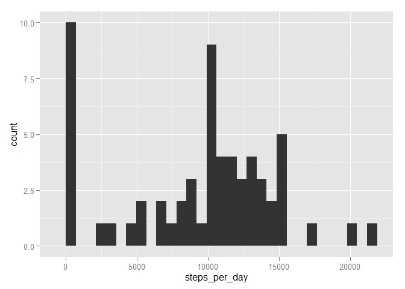
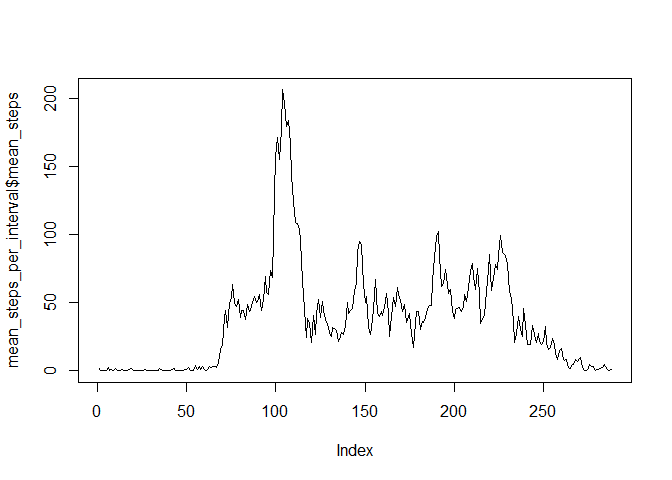
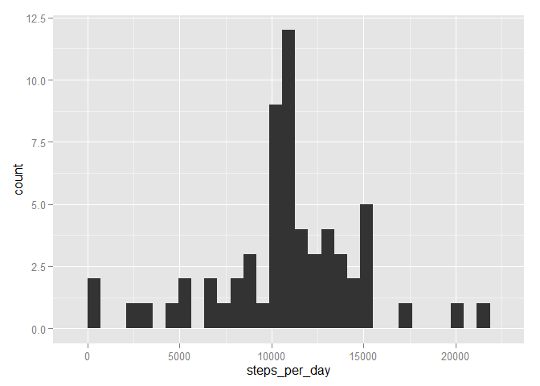
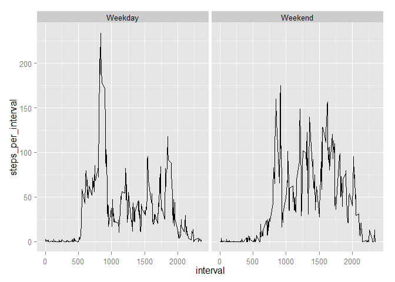

# Reproducible Research: Peer Assessment 1


**Task**

It is now possible to collect a large amount of data about personal movement using activity monitoring devices such as a Fitbit, Nike Fuelband, or Jawbone Up. These type of devices are part of the quantified self movement - a group of enthusiasts who take measurements about themselves regularly to improve their health, to find patterns in their behavior, or because they are tech geeks. But these data remain under - utilized both because the raw data are hard to obtain and there is a lack of statistical methods and software for processing and interpreting the data.

This assignment makes use of data from a personal activity monitoring device. This device collects data at 5 minute intervals through out the day. The data consists of two months of data from an anonymous individual collected during the months of October and November, 2012 and include the number of steps taken in 5 minute intervals each day.

##Loading and preprocessing the data

Reading in the data: 


```r
rawdata <- read.csv("activity//activity.csv")
```

Date is a factor, I prefer data format:


```r
library(timeDate)
nicedata<-rawdata
nicedata$date<- as.POSIXlt(rawdata$date,format="%Y-%m-%d")
```


##What is mean total number of steps taken per day?


```r
library(ggplot2) #for nice pictures
library(plyr) # for easy manipulation of data frames
number_of_steps_per_day<-ddply(nicedata,.(date),summarize,steps_per_day = sum(steps, na.rm =TRUE ))
mean_number_of_steps<- mean(number_of_steps_per_day$steps_per_day)
 median_number_of_steps<- median(number_of_steps_per_day$steps_per_day)
```
The mean number of steps per day is given by 9354.23

The median number of steps per day is given by 10395.


A histogram displaying the number of steps is given below.

 

##What is the average daily activity pattern?


```r
mean_steps_per_interval<-ddply(nicedata,.(interval),summarize,mean_steps = mean(steps, na.rm =TRUE ))
```
Make a time series plot (i.e. type = "l") of the 5-minute interval (x-axis) and the average number of steps taken, averaged across all days (y-axis):

 

Which 5-minute interval, on average across all the days in the dataset, contains the maximum number of steps?


```r
max_interval<- mean_steps_per_interval$interval[mean_steps_per_interval$mean_steps==max(mean_steps_per_interval$mean_steps)]
```

The interval 835 contains the maximum number of steps.

##Imputing missing values

```r
missing_values<-is.na(nicedata$steps)
```


The number of missing values is 2304.
We are going to fill in the missing values by the mean steps taken in the corresponding interval:


```r
filled_data<-join(nicedata, mean_steps_per_interval, by ="interval")
filled_data <- within(filled_data, interpolsteps <- ifelse(!is.na(steps),steps,mean_steps))
```

Make a histogram of the total number of steps taken each day and Calculate and report the mean and median total number of steps taken per day. Do these values differ from the estimates from the first part of the assignment? What is the impact of imputing missing data on the estimates of the total daily number of steps?


```r
imputed_number_of_steps_per_day<-ddply(filled_data,.(date),summarize,steps_per_day = sum(interpolsteps, na.rm =TRUE ))
imputed_mean_number_of_steps<- mean(imputed_number_of_steps_per_day$steps_per_day)
 imputed_median_number_of_steps<- median(imputed_number_of_steps_per_day$steps_per_day)
```

The mean number of steps per day in the filled data is given by 1.076619\times 10^{4}.

The median number of steps per day in the filled data is given by 1.0766189\times 10^{4}.

A histogram displaying the number of steps in the filled up version is given below.

 

As we can see the distribution gets more symmetric when we impute missing numbers. Mean and median increase (and by coincidence converge, apparently this is, because several days had been totally missing and thus are replaced by the new mean value, which happens to be the median too)

##Are there differences in activity patterns between weekdays and weekends?

Add a factor variable, indicating whether a day is a weekday or weekend:


```r
filled_data$wend <- as.factor(ifelse(weekdays( filled_data$date) %in% c("Samstag","Sonntag"), "Weekend", "Weekday")) 
```

Make a panel plot containing a time series plot of the 5-minute interval (x-axis) and the average number of steps taken, averaged across all weekday days or weekend days (y-axis). 


```r
mean_steps_per_interval_and_weekday<-ddply(filled_data,.(interval,wend),summarize,steps_per_interval = mean(steps, na.rm =TRUE ))

p <- ggplot(mean_steps_per_interval_and_weekday, aes(interval, steps_per_interval)) + geom_line()
# With one variable
p + facet_grid(. ~ wend)
```

 


